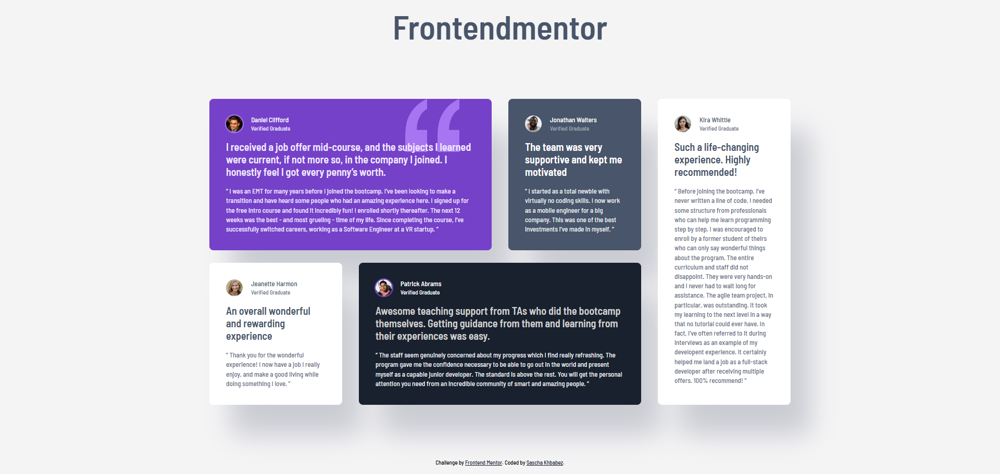
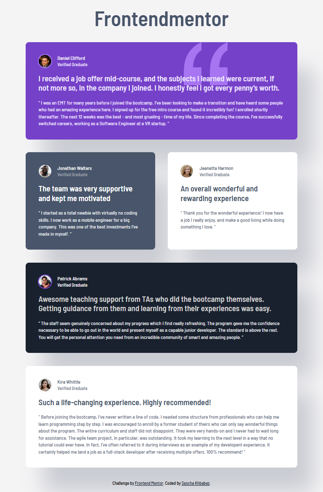

# Frontend Mentor - Testimonials grid section solution

This is a solution to the [Testimonials grid section challenge on Frontend Mentor](https://www.frontendmentor.io/challenges/testimonials-grid-section-Nnw6J7Un7). Frontend Mentor challenges help you improve your coding skills by building realistic projects.

## Table of contents

- [Overview](#overview)
  - [The challenge](#the-challenge)
  - [Screenshot](#screenshot)
  - [Links](#links)
- [My process](#my-process)
  - [Built with](#built-with)
  - [What I learned](#what-i-learned)
  - [Continued development](#continued-development)
  - [Useful resources](#useful-resources)

**Note: Delete this note and update the table of contents based on what sections you keep.**

## Overview

### The challenge

Users should be able to:

- View the optimal layout for the site depending on their device's screen size

### Screenshot

### Links

- Solution URL: [https://github.com/skhbabez/testimonials-grid-section-main](https://github.com/skhbabez/testimonials-grid-section-main)
- Live Site URL: [https://skhbabez.github.io/testimonials-grid-section-main/](https://skhbabez.github.io/testimonials-grid-section-main/)

## My process

### Built with

- Semantic HTML5 markup
- CSS custom properties
- Flexbox
- CSS Grid
- Mobile-first workflow
- CUBE Design Principles

### What I learned

I learned how to utilize type and spacing scales better, using websites like utopia.fiy as a starting point. I also got a better grip on how grid works, especially getter a better understanding on how to layout columns and rows sizing wise. But most of all this taught me alot on how to reuse custom properties to make styling similiar components easier.

### Continued development

I am not happy yet with the way I designed my type and spacing scales and need to develop a better sense for them especially from a responsive standpoint. I also want to dive deeper into grids, especially into designing responsive grids without fixed column numbers.

### Useful resources

- [Utopia](https://utopia.fyi/) - I aused this to experiment with type and spacing scales and I am gonna use this more in the future.
